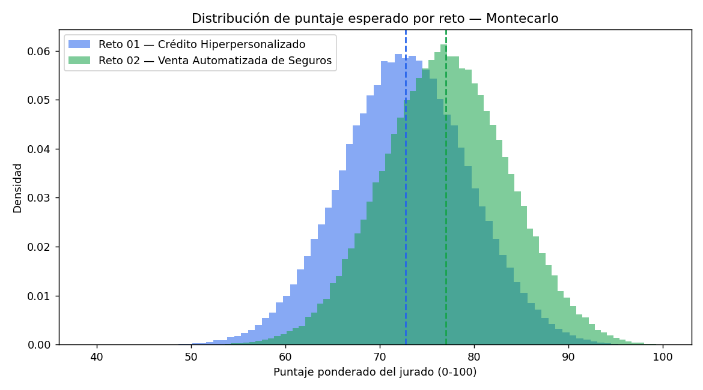
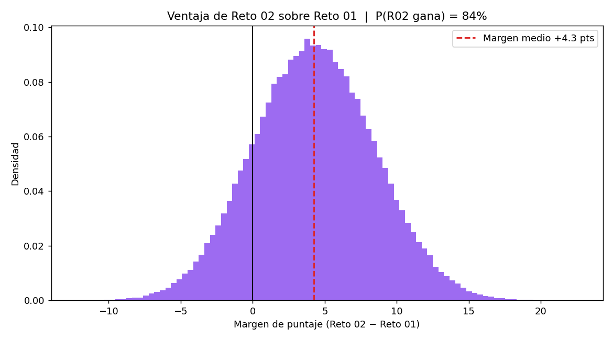
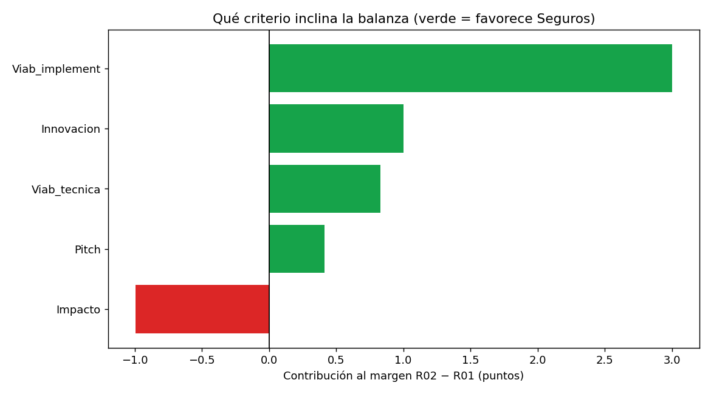

# Dossier de Diagnóstico Exprés — Hackathon Colsubsidio 2026

**Retos analizados:** Reto 01 (Crédito Hiperpersonalizado) y Reto 02 (Venta Automatizada de Seguros)
**Equipo:** Scala Labs · **Elaborado:** 21 jul 2026 · **Método:** datos públicos citados + frameworks estratégicos + Montecarlo de 200.000 escenarios

---

## Resumen ejecutivo

**Recomendación: apostar por el Reto 02 (Venta Automatizada de Seguros) para ganar el jurado, con el Reto 01 como plan B defendible.** El Montecarlo sobre 200.000 escenarios da al Reto 02 una probabilidad del **84,3%** de superar al Reto 01 en el puntaje ponderado del jurado, con puntaje esperado de **77,0 vs 72,7** sobre 100.

La diferencia no es de moda ni de gusto: la mueve la **viabilidad de implementación** (+3,0 pts de los +4,25 de margen). Vender un seguro de forma automatizada choca con menos regulación y menos dependencia de datos crediticios que montar un motor de crédito hiperpersonalizado, y el stack real de Juan (no-code, n8n, funnels de conversión, UX) encaja mejor con un funnel conversacional que con un modelo de scoring de riesgo en producción.

Hay un matiz que el equipo debe tener claro: en **impacto puro, el Reto 01 gana** (contribuye −1,0 pt al margen, o sea a favor de Crédito). El acceso a crédito en Colombia es del 35,5% y Colsubsidio tiene datos de comportamiento ricos de 1,6 millones de afiliados. Si la meta fuera el mayor impacto social de fondo por encima de ganar el evento, Crédito es la apuesta más profunda. Para ganar la hackathon con lo que se puede construir en tres días, Seguros es la apuesta con mejor relación riesgo/retorno.

El margen no es garantía. En el 5% peor de los escenarios el Reto 02 pierde por 2,6 pts, así que la ejecución del fin de semana (demo que funcione, pitch limpio) sigue decidiendo. La recomendación es firme, no ciega.

---

## 1. Contexto de mercado (datos reales)

**Colsubsidio.** Es la caja de compensación con más afiliados de Colombia: **1.621.106 trabajadores afiliados** y más de **2,8 millones de personas** entre afiliados y beneficiarios, con **$1,5 billones** destinados a subsidios en 2025. Ya opera crédito social (libre inversión hasta $150 millones, con tasa preferencial según categoría de afiliado y mejores condiciones vía libranza) y seguros (vida con cobertura de desempleo, muerte accidental, renta hospitalaria; convenio de seguros masivos con MetLife). Los dos retos parten de una base instalada enorme y de productos que ya existen: el reto es la personalización y la automatización, no crear el producto desde cero.

**Crédito en Colombia.** El 96,3% de los adultos tiene al menos un producto de depósito o crédito, pero el acceso al crédito se queda en **35,5%** de la población adulta y el crédito de consumo cayó a **19%**, su nivel más bajo desde que se mide. La tarjeta de crédito llega al 23,3% y sigue concentrada en zonas urbanas. Hay techo de crecimiento y un problema real de acceso, pero también un mercado con muchos jugadores y regulación fuerte.

**Seguros en Colombia.** La penetración es de **3,29% del PIB**, muy por debajo del **9,3% de la OCDE**, con un consumo per cápita cercano a $1,07 millones al año. El sector crece rápido (primas +9,4% a septiembre; salud +24%; vida individual +12%) y Fasecolda ya empuja seguros inclusivos con su laboratorio NOVASEG. La brecha frente a la OCDE es la señal más fuerte de mercado desatendido de los dos retos: hay millones de personas sin cobertura que la contratarían si el proceso fuera simple.

**Tecnología (Gartner Hype Cycle 2025).** La IA agéntica debutó en la cima del Hype Cycle de tecnologías emergentes, en el Pico de Expectativas Infladas: solo el 17% de las organizaciones ha desplegado agentes, pero más del 60% planea hacerlo en dos años. Traducción para la hackathon: un agente de IA que cierra una venta o arma una oferta es exactamente el tipo de caso que hoy genera atención del jurado, con la contra de que "poner un agente" está sobrevendido. Gana quien muestre el agente resolviendo un problema concreto, no el agente por sí mismo.

**Trasfondo social (relevante para el criterio de impacto).** Colombia tenía 2,3 millones de jóvenes que ni estudian ni trabajan en octubre de 2025 (uno de cada cinco), con las mujeres más golpeadas (16,3% frente a 8,0% de los hombres). Es población que Colsubsidio toca y que conecta el reto con un problema país, útil para el pitch de impacto.

---

## 2. Reto 01 — Crédito Hiperpersonalizado

**Problema:** ofrecer al afiliado la mejor opción de crédito según su perfil y comportamiento, en el canal y momento oportunos.
**Solución propuesta:** motor de segmentación inteligente + enriquecimiento de perfil con datos comportamentales + generación dinámica de ofertas por canal.

### DOFA

| Fortalezas | Debilidades |
|------------|-------------|
| Encaja con la experiencia real de Juan en scoring/riesgo | Depende de acceso a datos crediticios reales que en 3 días no se tendrán |
| Colsubsidio ya tiene el producto y las categorías de afiliado (A/B/C) | Modelo de riesgo creíble exige validación que no cabe en el fin de semana |
| Datos de 1,6M afiliados = materia prima para personalizar | Curva regulatoria alta (Habeas Data, reporte a centrales, SFC) |

| Oportunidades | Amenazas |
|---------------|----------|
| Acceso a crédito estancado en 35,5%: headroom claro | Muchos competidores hacen scoring; difícil sobresalir en innovación |
| Libranza + categoría de afiliado permiten ofertas muy afinadas | Jurado puede castigar promesas de personalización sin datos que las respalden |
| Un agente que arma la oferta correcta puntúa alto en tendencia IA | Riesgo reputacional si la "hiperpersonalización" parece caja negra |

### PESTEL

- **Político/legal:** habeas data y regulación de la Superfinanciera pesan sobre cualquier decisión de crédito automatizada. Es el factor que más limita la implementación real.
- **Económico:** crédito de consumo en mínimos (19%); hay demanda contenida pero también riesgo de cartera que endurece la oferta.
- **Social:** desconfianza y baja educación financiera hacen que la personalización deba explicarse, no imponerse.
- **Tecnológico:** scoring con IA y enriquecimiento de datos están maduros; la parte técnica es alcanzable.
- **Ecológico:** irrelevante para este reto.
- **Legal (datos):** el tratamiento de datos comportamentales necesita consentimiento explícito; el demo debe mostrarlo para ser creíble.

### Cinco Fuerzas de Porter

- **Rivalidad:** alta. Bancos, fintechs y otras cajas ya compiten en crédito personalizado.
- **Nuevos entrantes:** media-alta; el no-code baja la barrera técnica pero la regulación la sube.
- **Poder del cliente (afiliado):** medio; tiene alternativas, pero la tasa preferencial de Colsubsidio ata.
- **Poder de proveedores (datos/centrales de riesgo):** alto; sin datos no hay personalización.
- **Sustitutos:** altos (tarjetas, gota a gota, crédito informal).

### Escenarios

- **Mejor caso:** el equipo muestra un agente que toma el perfil de un afiliado tipo y arma una oferta afinada con explicación clara del porqué; el jurado ve impacto y viabilidad técnica. Puntaje hacia P95 ≈ 83,8.
- **Peor caso:** la personalización se queda en promesa sin datos reales y el demo parece un formulario con reglas fijas; el jurado castiga viabilidad e innovación. Puntaje hacia P5 ≈ 61,7.

---

## 3. Reto 02 — Venta Automatizada de Seguros

**Problema:** llevar al afiliado de "no sé qué seguro necesito" a "quedé asegurado", 24/7, sin intervención humana.
**Solución propuesta:** funnel conversacional inteligente + backend automatizado de cotización y cierre instantáneo.

### DOFA

| Fortalezas | Debilidades |
|------------|-------------|
| Encaja de lleno con el stack de Juan: funnels, UX/UI, n8n, conversión | Cierre "sin humano" toca normas de intermediación de seguros |
| Colsubsidio ya tiene seguros y convenio con MetLife: producto listo | Cotización real depende de tarifas del asegurador (se simula en el MVP) |
| Demo "quedé asegurado 24/7" es visual y fácil de mostrar | Riesgo de venta inadecuada si el funnel no entiende bien la necesidad |

| Oportunidades | Amenazas |
|---------------|----------|
| Penetración 3,29% del PIB vs 9,3% OCDE: mercado enorme desatendido | Insurtech de moda: hay que diferenciar de lo ya visto |
| Fasecolda empuja seguros inclusivos (NOVASEG): viento a favor | Jurado puede exigir claridad sobre cumplimiento normativo del cierre |
| Un agente conversacional que cierra encaja con la tendencia IA 2025 | Confianza: asegurarse por chat aún genera fricción cultural |

### PESTEL

- **Político/legal:** existe marco de intermediación de seguros, pero la venta asistida por canal digital ya está aceptada; menos fricción que en crédito.
- **Económico:** gasto per cápita en seguros creciendo (+9,4% en primas); hay disposición a pagar cuando el proceso es simple.
- **Social:** baja cultura aseguradora; el funnel conversacional puede educar y cerrar en el mismo flujo.
- **Tecnológico:** cotización + chatbot + cierre digital son componentes maduros y ensamblables con no-code.
- **Ecológico:** relevante solo en ramos específicos (agro, catástrofe); no es central para el MVP.
- **Legal (protección al consumidor):** el flujo debe dejar registro del consentimiento y de la idoneidad del producto ofrecido.

### Cinco Fuerzas de Porter

- **Rivalidad:** media-alta; hay insurtech, pero pocos con cierre conversacional 24/7 real en Colombia.
- **Nuevos entrantes:** alta; el no-code facilita entrar, lo que obliga a diferenciar por experiencia.
- **Poder del cliente:** medio; muchas opciones, pero baja penetración = demanda sin atender.
- **Poder de proveedores (aseguradoras):** medio-alto; la tarifa la pone el asegurador, el valor está en la distribución.
- **Sustitutos:** medios (venta tradicional con agente, seguros embebidos en otros productos).

### Escenarios

- **Mejor caso:** el jurado prueba el funnel, responde tres preguntas y "queda asegurado" en el demo, con cotización y consentimiento visibles; puntúa alto en impacto, viabilidad e presentación. Puntaje hacia P95 ≈ 87,9.
- **Peor caso:** el funnel recomienda un seguro genérico sin entender la necesidad y el cierre parece un formulario; se pierde el efecto "24/7 sin humano". Puntaje hacia P5 ≈ 66,1.

---

## 4. Montecarlo de decisión

### Cómo se modeló

Se simuló el puntaje ponderado del jurado (0–100) para cada reto sobre **200.000 escenarios**, usando los pesos oficiales del Punto 12: impacto 30%, innovación 20%, viabilidad técnica 20%, viabilidad de implementación 20%, presentación 10%. Cada criterio se muestreó con una distribución Beta-PERT calibrada con un rango (mínimo, moda, máximo) por reto, y se aplicó un **shock de ejecución común** a ambos retos en cada escenario para reflejar que el mismo equipo, en el mismo fin de semana, rinde parecido en las dos opciones.

Aviso de honestidad, por la regla de no inventar datos: los rangos de cada criterio no son hechos medidos, son juicio experto explícito sobre lo plausible, calibrado con los datos de mercado de la sección 1 y con las capacidades reales del equipo. El Montecarlo sirve para cuantificar esa incertidumbre, no para disfrazarla de certeza. Los supuestos están abiertos en `montecarlo_decision.py`: si cambian, el resultado se recalcula.

### Resultados

| Reto | Puntaje medio | P5 | Mediana | P95 |
|------|---------------|----|---------|-----|
| Reto 01 — Crédito | 72,7 | 61,7 | 72,7 | 83,8 |
| Reto 02 — Seguros | 77,0 | 66,1 | 77,0 | 87,9 |

- **P(Reto 02 gana) = 84,3%** · P(Reto 01 gana) = 15,7%
- **Margen medio (Seguros − Crédito) = +4,25 pts**, con rango P5 −2,6 y P95 +11,2.

### Qué mueve la balanza

| Criterio | Contribución al margen | A favor de |
|----------|------------------------|-----------|
| Viabilidad de implementación | +3,00 pts | Seguros |
| Innovación | +1,00 pts | Seguros |
| Viabilidad técnica | +0,83 pts | Seguros |
| Presentación / pitch | +0,41 pts | Seguros |
| Impacto | −1,00 pts | **Crédito** |

La lectura es directa: Seguros gana porque se puede implementar y demostrar mejor en tres días, no porque tenga más impacto. El impacto es el único criterio donde Crédito manda. Si el equipo encuentra la forma de que Crédito muestre implementación real (no promesa), la brecha se cierra.

---

## 5. Síntesis y siguientes pasos

Para ganar la hackathon, el camino de menor riesgo y mayor puntaje esperado es el Reto 02 (Seguros): mercado más desatendido (3,29% vs 9,3% OCDE), producto ya existente en Colsubsidio, encaje con el stack real del equipo y un demo que se ve y se entiende. El Reto 01 (Crédito) es la apuesta de mayor impacto social de fondo, pero paga un costo alto en viabilidad de implementación bajo la presión de tres días.

Decisión a tomar el Día 1 con este dossier enfrente: si el equipo tiene alguien fuerte en modelos de riesgo y consigue simular datos de crédito creíbles, Crédito vuelve a ser competitivo. Si no, Seguros es la jugada.

**Siguientes pasos concretos (Día 1):**

1. Leer este resumen en equipo y votar reto antes del mediodía del 22 jul.
2. Escribir en una frase el afiliado concreto y el problema que resolvemos.
3. Definir el "quedó hecho" del MVP: la acción que el jurado verá funcionando.
4. Abrir el `montecarlo_decision.py` y ajustar la calibración si el equipo tiene datos mejores; recalcular antes de cerrar la decisión.

---

## Fuentes

- Colsubsidio — Balance 2025 (2,8 millones beneficiados, $1,5 billones): [colsubsidio.com](https://www.colsubsidio.com/blog-y-noticias/balance-2025) · [El Tiempo](https://www.eltiempo.com/amp/economia/empresas/colsubsidio-destino-1-5-billones-en-subsidios-y-acompano-a-2-8-millones-de-afiliados-durante-3533939)
- Colsubsidio — Crédito libre inversión y libranza: [colsubsidio.com](https://www.colsubsidio.com/creditos/consumo/libre-inversion) · Convenio de seguros MetLife: [metlife.com.co](https://www.metlife.com.co/seguros-masivos/colsubsidio/)
- Reporte de Inclusión Financiera 2024 (acceso a crédito 35,5%, consumo 19%, 96,3% con producto): [Banca de las Oportunidades](https://www.bancadelasoportunidades.gov.co/es/noticias/banca-de-las-oportunidades-y-la-superfinanciera-lanzan-el-reporte-de-inclusion-financiera) · [El Espectador](https://www.elespectador.com/economia/inclusion-financiera-este-es-el-panorama-del-acceso-a-credito-en-colombia-noticias-hoy/)
- Penetración de seguros 3,29% del PIB vs 9,3% OCDE; crecimiento de primas: [La República](https://www.larepublica.co/finanzas/la-penetracion-del-sector-asegurador-paso-de-24-a-27-del-pib-en-un-ano-2128896) · [Fasecolda](https://www.fasecolda.com/) · [Valora Analitik (insurtech)](https://www.valoraanalitik.com/insurtech-colombia-inversion-retos-2025/)
- Gartner Hype Cycle 2025 — IA agéntica en el pico, 17% desplegado / 60% en 2 años: [Gartner newsroom](https://www.gartner.com/en/newsroom/press-releases/2025-09-10-gartner-unveils-top-emerging-technologies-to-support-autonomous-business) · [Gartner AI Hype Cycle](https://www.gartner.com/en/newsroom/press-releases/2025-08-05-gartner-hype-cycle-identifies-top-ai-innovations-in-2025)
- Ninis en Colombia (2,3M en oct 2025, 24,2% Q1, brecha de género): [El Tiempo](https://www.eltiempo.com/amp/economia/sectores/el-dane-revelo-que-en-colombia-los-jovenes-que-no-estudian-ni-trabajan-bajaron-a-2-3-millones-su-nivel-mas-bajo-en-ocho-anos-3517602) · [Infobae](https://www.infobae.com/colombia/2025/07/11/colombia-tiene-25-millones-de-ninis-la-generacion-que-el-sistema-sigue-dejando-atras/)

_Nota: los datos de mercado provienen de las fuentes citadas. Los rangos del Montecarlo son supuestos calibrados, no hechos medidos; están documentados y son editables en el script._
