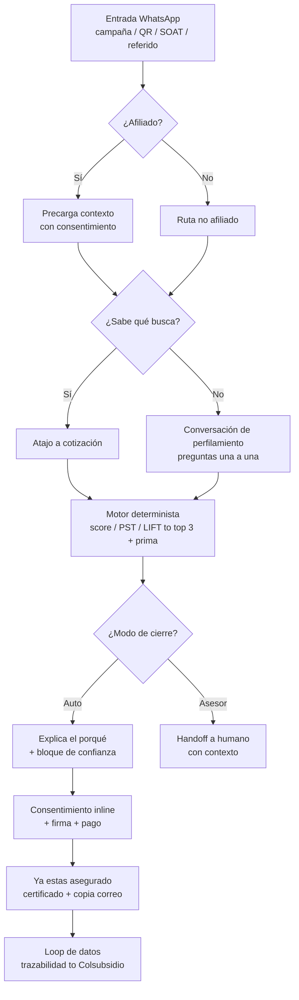

# Backlog & DoR — Jarvis (MVP Reto 02 · Seguros)

**Scala Labs · Hackathon Colsubsidio 30X**

Idea central: *Un asesor en WhatsApp que se interesa en conocerte, entiende qué seguro buscas o te sugiere el que encaja con tu momento de vida y tu bolsillo con un porqué claro, te lo explica sin tecnicismos y te deja asegurado, con firma y pago, y con un loop de feedback y data que vuelve a Colsubsidio.*

Regla de arquitectura que ordena todo el backlog: **el modelo conversa y explica; un motor determinista pone las cifras.** Nada de caja negra.

> **Nota de alcance (firma y pago):** el brief lista firma legal y pasarela reales como *fuera de alcance*. En este backlog van marcadas `[MVP: simulado / Visión: real]`. La decisión final (construir vs. camino a producción) se cierra con Jorge (viabilidad) y Sandra (alineación). Hasta entonces, el MVP los simula.

---

## 1. Definition of Ready (DoR)

Una historia está **Ready** (lista para que un dev la tome) solo si cumple TODO esto:

- **Qué:** acción concreta y pequeña, cabe en un día de trabajo.
- **Para quién:** rol o usuario claro (afiliado, no afiliado, asesor, equipo de datos).
- **Criterio de aceptación:** verificable y demostrable en la demo (formato Dado/Cuando/Entonces o checklist).
- **Assets / links:** todo lo necesario enlazado (mockup, dato, prompt, endpoint, doc). Si falta un asset, la historia NO está ready.
- **Sin bloqueos abiertos** y dependencias identificadas.
- **Dueño asignado** y EPIC padre.
- **Cabe en el MVP** (no es visión).

### Definition of Done (DoD)

Una historia está **Done** cuando: está mergeada a `main` vía PR con visto bueno técnico, probada en el happy path, documentada, y **recorrible en la demo sin explicación del equipo**.

---

## 2. Journey del usuario — de "no sé qué necesito" a "quedé asegurado"

| Etapa | Qué hace el usuario | Qué hace el sistema | El "porqué" visible | EPIC |
|---|---|---|---|---|
| 1. Entrada | Abre WhatsApp (campaña, QR, renovación SOAT, referido) | Enrutador recibe con contexto de origen | "Hola, soy tu asesor de seguros" | E1 |
| 2. Identificación | (invisible) | Valida afiliado / no afiliado; precarga contexto con consentimiento | "Para cuidar tus datos, valido quién eres" | E2 |
| 3. Intención | "Ya sé qué busco" / "No sé" | Atajo a cotización o inicia conversación | "¿Ya sabes qué quieres proteger?" | E1, E3 |
| 4. Perfilamiento | Responde preguntas, una a la vez | Captura variables sin jerga | "Te pregunto esto para recomendarte lo que te conviene, no lo más caro" | E3 |
| 5. Recomendación | Ve top de opciones | Motor determinista → top 3 + prima como % del ingreso | "Te sugiero esto porque respondiste X" | E4, E5 |
| 6. Ajuste | Compara, cambia coberturas, pregunta | Recalcula; resuelve dudas | Muestra la variable que justifica cada opción | E5 |
| 7. Confianza | Duda "¿me pagarán?" | Bloque de confianza antes del pago | "Respuesta en menos de 24 h, sin papeleo" | E5 |
| 8. Cierre | Acepta, firma, paga | Consentimiento inline → firma → pago `[MVP: simulado]` | Checkbox explícito con producto y prima | E6 |
| 9. Confirmación | Recibe certificado | "Ya estás asegurado" + número + copia al correo | Cierre celebratorio, sin "aprobación pendiente" | E7 |
| 10. Post-venta | (después) | Loop de datos a Colsubsidio; sugerencia de paquete | "Guarda tu chat con un clic" | E7, E8 |

---

## 3. Flujos

### 3.1 Flujo principal (happy path)

### 3.2 Enrutador (simple vs. complejo)

Cinco puntos de entrada convergen en un enrutador central. El enrutador separa **soluciones simples** (las resuelve Jarvis solo: SOAT, mascotas, hogar) de **complejas** (vida, salud → pasan a asesor humano con el contexto ya recogido). API agnóstica al canal para poder cambiar de canal sin rehacer el sistema.

### 3.3 Flujo del motor

Respuestas (diccionario de 11 variables + 2 opcionales) → matriz de pesos → score / PST / LIFT → top 3 con % de afinidad → modo de cierre (auto vs. asesor). El LLM nunca calcula el número; solo lo comunica.

### 3.4 Flujo de cierre

Consentimiento inline (idoneidad) → resumen con producto + prima → firma en el chat `[MVP: simulado]` → pago `[MVP: simulado]` → certificado + copia al correo + opción de respaldo del chat.

### 3.5 Casos borde

No afiliado (ruta de captación), producto complejo (handoff a asesor), abandono (se registra como señal de propensión), sin closed captions / dato faltante (se pide o se simula).

---

## 4. EPICs e historias

Formato: **Como** [rol] **quiero** [qué] **para** [para qué] · *Criterios* · *Assets*.

### EPIC 0 — Infraestructura y despliegue *(habilitador · depende de Jorge)*

**H0.1 · Definir el stack.** Como equipo, quiero decidir canal WhatsApp, LLM, backend, base de datos y hosting, para poder construir sin rehacer.
- Criterios: decisión documentada, validada con Jorge, que cabe en el tiempo restante.
- Assets: sesión con Jorge; opciones A (demo que simula chat) y B (WhatsApp real).

**H0.2 · Repo y ramas.** Como equipo, quiero el repositorio con `main` protegido y ramas por dev, para no pisarnos.
- Criterios: estructura de carpetas definida; PRs con visto bueno; merges centralizados.
- Assets: README del repo, GitHub Desktop.

**H0.3 · Entorno de WhatsApp.** Como dev, quiero enviar y recibir mensajes de prueba, para tener el canal vivo.
- Criterios: mensaje de ida y vuelta funcionando (Twilio/Meta o simulador web).
- Assets: credenciales sandbox.

**H0.4 · Base de datos de sesión/perfil.** Como dev, quiero guardar las respuestas por sesión con hashing de PII, para alimentar el motor sin exponer datos.
- Criterios: persiste respuestas; PII por serie/hash, no en claro.
- Assets: schema; política de privacidad.

### EPIC 1 — Canal y entrada / enrutador

**H1.1 · Entrada multipuerta.** Como usuario, quiero entrar por campaña, QR, renovación de SOAT o referido, para llegar por donde ya estoy.
- Criterios: cada puerta abre el chat con el contexto de origen.
- Assets: arquitectura de Daniel.

**H1.2 · Enrutador simple vs. complejo.** Como sistema, quiero decidir si Jarvis resuelve o deriva a un asesor, para no forzar automatización donde no aplica.
- Criterios: productos simples → Jarvis; complejos (vida/salud) → asesor.
- Assets: matriz de Carolina; reglas del enrutador.

**H1.3 · Saludo y detección de intención.** Como usuario, quiero decir si ya sé qué busco, para tomar un atajo o dejar que me guíen.
- Criterios: "¿ya sabes qué buscas?" → atajo a cotización o conversación.
- Assets: prompt del agente; playbook Lemonade (pregunta 1).

### EPIC 2 — Identificación y validación

**H2.1 · Validar afiliado / no afiliado.** Como sistema, quiero saber el tipo de persona antes de ofertar, para dar la ruta correcta.
- Criterios: determina el tipo al inicio; ruta distinta para cada uno.
- Assets: base de afiliados v2.

**H2.2 · Hashing de datos personales.** Como equipo, quiero manejar la PII por hash/serie, para cumplir privacidad.
- Criterios: ningún dato personal en claro en logs ni DB.
- Assets: política de privacidad; Ley 1581/2012.

**H2.3 · Precargar contexto conocido.** Como afiliado, quiero que ya sepan lo básico de mí (con mi permiso), para no repetir todo.
- Criterios: precarga con consentimiento explícito; el usuario puede corregir.
- Assets: base v2; segmentos.

### EPIC 3 — Conversación de perfilamiento

**H3.1 · Preguntas una a la vez, sin jerga.** Como usuario, quiero una pregunta por mensaje en lenguaje llano, para no sentir un formulario.
- Criterios: nunca un formulario visible; "lo que pagas al mes", no "prima".
- Assets: playbook Lemonade; guion.

**H3.2 · Las 11 variables, claras y bien dirigidas.** Como equipo, quiero preguntas específicas y en la dirección correcta, para no romper la recomendación.
- Criterios: cada pregunta revisada (ej. arrendamiento = dueño, no inquilino); binaria donde aplica.
- Assets: revisión de Carolina; daily técnica de scoring.

**H3.3 · Rango de pago en botones.** Como usuario, quiero elegir cuánto puedo pagar con botones, para no escribir cifras.
- Criterios: rangos en botones, el del medio preseleccionado.
- Assets: UX; playbook (pregunta 3).

**H3.4 · Contacto al final.** Como usuario, quiero dar mis datos solo cuando el sistema ya demostró que me entiende, para confiar.
- Criterios: datos personales de último.
- Assets: playbook (pregunta 5).

**H3.5 · El LLM no inventa cifras.** Como equipo, quiero que el modelo solo converse y toda cifra venga del motor, para que nada sea caja negra.
- Criterios: ninguna prima o score generado por el LLM; siempre del motor.
- Assets: regla de arquitectura.

### EPIC 4 — Motor de recomendación (determinista)

**H4.1 · Motor de scoring v2.** Como producto, quiero un motor que devuelva top 3 con % de afinidad y modo de cierre, para recomendar con un porqué y no con ruido.
- Criterios: corrige el inflado por tope desigual (score/PST/LIFT); salida reproducible.
- Assets: daily técnica de scoring; código del motor; análisis de Daniel.

**H4.2 · Reglas duras (banderas).** Como producto, quiero que ciertas respuestas clave (preguntas 7/9/10) metan el producto directo al top 3, para no ahogar señales fuertes.
- Criterios: si la bandera se activa, el producto entra sin pasar por la suma.
- Assets: análisis de Daniel.

**H4.3 · Prima como % del ingreso.** Como usuario, quiero una prima acorde a lo que gano, para que sea asequible.
- Criterios: calcula prima según rango salarial del perfil (base v2: 67% ≤1,5 SMLV).
- Assets: base v2; catálogo.

**H4.4 · Test de estrés del motor.** Como equipo, quiero personas sintéticas con salida esperada vs. real, para medir la fiabilidad antes de congelar.
- Criterios: diff documentado; casos donde el ruido infla o el trigger se ahoga.
- Assets: prompt de estrés (daily técnica).

**H4.5 · Modo de cierre (auto vs. asesor).** Como sistema, quiero marcar si el producto se vende solo o necesita humano, para respetar el reto y el riesgo.
- Criterios: vida/salud → asesor; SOAT/mascota/hogar → auto.
- Assets: matriz de Carolina.

### EPIC 5 — Explicación y confianza ("vende sin vender")

**H5.1 · Explicar el porqué.** Como usuario, quiero saber por qué me recomiendan ESTE seguro, para confiar en la sugerencia.
- Criterios: muestra la variable que lo justifica, en lenguaje llano.
- Assets: mapa segmento→producto de JP.

**H5.2 · Diferencia de tenerlo vs. no.** Como usuario, quiero entender el riesgo de no tenerlo, para decidir informado.
- Criterios: explica riesgo presente y futuro sin tecnicismos.
- Assets: guion.

**H5.3 · Bloque de confianza antes del pago.** Como usuario, quiero saber que me pagarán cuando lo necesite, para cerrar.
- Criterios: responde "¿me pagarán?" (rápido, sin papeleo) antes del pago.
- Assets: playbook.

**H5.4 · Precio como recompensa.** Como usuario, quiero una pantalla limpia con la prima en grande, para no perderme en jerga.
- Criterios: prima grande, un botón, cero jerga.
- Assets: Mixpanel (+250% conversión).

### EPIC 6 — Cierre: consentimiento, firma y pago

**H6.1 · Consentimiento inline (idoneidad).** Como usuario, quiero saber que me sugieren lo que me conviene, no lo más caro, para confiar en el cierre.
- Criterios: aviso antes de recomendar; checkbox explícito con producto y prima antes de cerrar.
- Assets: playbook de consentimiento.

**H6.2 · Firma en el chat `[MVP: simulado / Visión: legal]`.** Como usuario, quiero firmar sin salir del chat, para cerrar sin fricción.
- Criterios: MVP simula la firma; marcado como fuera de alcance del reto.
- Assets: nota de alcance; sesión Jorge/Sandra.

**H6.3 · Pago `[MVP: simulado / Visión: pasarela real]`.** Como usuario, quiero pagar en el chat, para quedar cubierto.
- Criterios: MVP simula el pago/suscripción.
- Assets: nota de alcance (el brief excluye pasarela real).

**H6.4 · Confirmación "ya estás asegurado".** Como usuario, quiero un cierre claro y celebratorio, para sentir que quedé cubierto.
- Criterios: número de póliza inmediato, sin "aprobación pendiente".
- Assets: playbook.

### EPIC 7 — Certificado y post-venta

**H7.1 · Certificado descargable.** Como usuario, quiero mi certificado con copia al correo, para tener soporte.
- Criterios: documento generado; PDF protegido con CC o token.
- Assets: idea C.

**H7.2 · Respaldo del chat.** Como usuario, quiero guardar y recuperar el chat y mis documentos con un clic, para no perderlos.
- Criterios: opción de backup en la nube de Colsubsidio; recuperación desde el chat.
- Assets: idea C.

**H7.3 · Sugerencia post-venta.** Como usuario, quiero que me sugieran beneficios que encajan, para aprovechar el ecosistema.
- Criterios: paquete/cross-sell sugerido tras el cierre.
- Assets: reporte de JP (marketplace).

### EPIC 8 — Loop de datos y feedback a Colsubsidio

**H8.1 · Trazabilidad de la conversación.** Como Colsubsidio, quiero que cada respuesta sea un dato etiquetado, para reentrenar el motor y afinar marketing.
- Criterios: guarda qué protege, quién depende, cuánto paga, qué cobertura tiene.
- Assets: flywheel de JP.

**H8.2 · Los abandonos también cuentan.** Como Colsubsidio, quiero registrar dónde abandona la gente, para segmentar remarketing.
- Criterios: punto de abandono = señal de propensión.
- Assets: JP.

**H8.3 · Consentimiento de datos (habeas data).** Como usuario, quiero autorizar el uso de mis datos con finalidad explícita, para estar tranquilo.
- Criterios: consentimiento inline con finalidad (Ley 1581/2012).
- Assets: análisis regulatorio de JP.

**H8.4 · Resumen de data para Colsubsidio.** Como Colsubsidio, quiero un panel de propensión y cierre, para dirigir el marketing.
- Criterios: métricas por segmento y producto.
- Assets: JP.

### EPIC 9 — Casos complejos / asesor humano

**H9.1 · Handoff a asesor.** Como usuario con un caso complejo, quiero pasar a un humano con mi contexto ya recogido, para no repetir.
- Criterios: deriva vida/salud/dudas con el historial.
- Assets: arquitectura.

**H9.2 · Reasignación del tiempo humano *(visión)*.** Como Colsubsidio, quiero que el asesor se enfoque en retención y upselling, para invertir su tiempo donde hay retorno.
- Criterios: humano reservado a retención/upselling/casos personalizados.
- Assets: roadmap de JP.

### EPIC 10 — Catálogo y reglas de producto

**H10.1 · Catálogo cargado.** Como sistema, quiero el catálogo (26 productos, 7 familias, 4 aseguradoras), para recomendar sobre lo que existe.
- Criterios: JSON/CSV cargado; SOAT con precio real (único público).
- Assets: `productos-seguros.json` de JP.

**H10.2 · Reglas segmento→producto.** Como producto, quiero cada producto con la variable que lo justifica, para responder el porqué.
- Criterios: regla explicable por variable observable.
- Assets: mapa de JP.

### EPIC 11 — Demo y pitch

**H11.1 · Flujo recorrible de punta a punta.** Como jurado, quiero recorrer el flujo sin que el equipo lo explique, para evaluar autogestión.
- Criterios: de "no sé" a "asegurado" sin intervención.
- Assets: demo.

**H11.2 · Dos perfiles con ofertas distintas.** Como jurado, quiero ver que la oferta cambia por perfil, para validar la personalización.
- Criterios: soltero sin hijos vs. monoparental → ofertas claramente distintas.
- Assets: segmentos reales (base v2).

**H11.3 · Guion de pitch con camino a producción.** Como equipo, quiero un guion que cuente MVP + visión, para impactar al jurado.
- Criterios: MVP recorrible + visión (marketplace, flywheel, giveback ya es ley).
- Assets: reporte de JP.

---

## 5. Cómo lo bajamos a ejecución

1. Cerrar el stack con Jorge Pilo, quien nos asesoró, y con la (H0.1) desbloquea todo el EPIC 0 y define qué es simulado.
2. Carolina valida las 11 preguntas (H3.2) y el modo de cierre (H4.5): desbloquea el motor v2.
3. Daniel refactoriza el motor (H4.1, H4.2, H4.4): el corazón del "porqué".
4. En paralelo, C monta la interfaz conversacional (EPIC 1, 3, 5) y el cierre (EPIC 6).
5. Todo lo que no sea happy path (EPIC 8 visión, EPIC 9) va después de que la demo se recorra completa.

Prioridad de build para la demo: EPIC 0 → 1 → 3 → 4 → 5 → 6 → 7 → 11. Los EPIC 8, 9 y 10 (visión y catálogo ampliado) sirven al pitch, no bloquean el recorrido.
